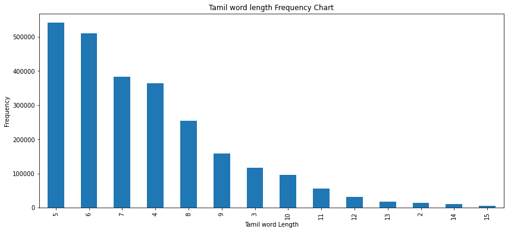

# all_tamil_words

unique_sorted_words_in_all_words_20200604-133955.txt.tar.bz2 - 9 MB

### Unix command to extract file

`tar xvjf unique_sorted_words_in_all_words_20200604-133955.txt.tar.bz2`

Which yields, 

`unique_sorted_words_in_all_words_20200604-133955.txt` - 85 mb

Total words count - 25,83,001

# Words and Frequency

Added the file words_and_frequency.tar.bz2
It has all the words and their frequency in descending order, for the datasets we get.

extract with the below command in linux

`tar xvjf words_and_frequency.tar.bz2`

yields, 

`words_and_frequency/` - 45 mb

## Insight Generation. 
(tamilwords_insights.ipynb)
### Data Cleaning
1. Removed words which are less than length 2 and greater than 15. 

### Frequency Chart

# Changelog
* March 24 2021 - words count - 2557643 ( After base Cleaning)
* June 4 2020 - words count - 25,83,001
* June 4 2020 - Added words and frequency file - words_and_frequency.tar.bz2
* May 27 2020 - words count - 23,92,064
* May 26 2020 - words count - 22,90,236

# LICENSE

Public Domain

